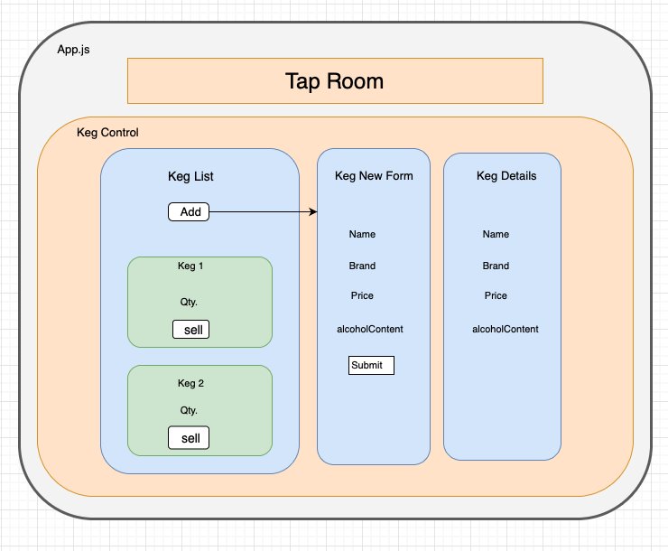

# Tap Room

### This is independent project that allows users to create drinks and track the amount of drink from selling

### Created by: Kate Kiatsiri

## Technologies Used

* JavaScript
* Node Package Manager
* React
* CSS
* HTML

## Description
This application was created to show understanding of building single page web apps with React js Library. This application contains CREATE and READ functionality, allowing the user to:
  - track how many pints are left in each keg
  - add new keg
  - see details of keg
  - sell pints from existing kegs

Requested User Specifications (user stories):
  - As a user, I want to see a list/menu of all available kegs. For each keg, I want to see its name, brand, price and alcoholContent (or perhaps something like flavor for a kombucha store).
  - As a user, I want to submit a form to add a new keg to a list.
  - As a user, I want to be able to click on a keg to see its detail page.
  - As a user, I want to see how many pints are left in a keg. A full keg has roughly 124 pints.
  - As a user, I want to be able to click a button next to a keg whenever I sell a pint of it. This should decrease the number of pints left by 1. Pints should not be able to go below 0.

## Diagrams / Component Layout

## Setup/Installation Requirements

* Download or clone [this](https://github.com/keidsiri/taproom-react) repository to your local machine
* Open the root project directory in the terminal
* Run the command '$ npm install' to install the needed plugins and packages
* Open the application by running the command '$ npm run start'.

## Known Bugs
* No known bugs

## License
[MIT](https://opensource.org/licenses/MIT) 2021

## Contact Information
[Kate Kiatsiri](github.com/keidsiri)